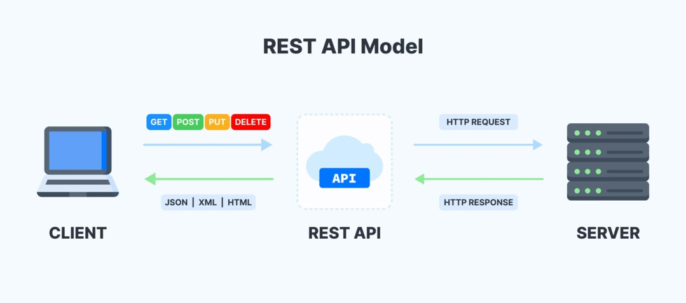

### Application Programming Interface (API)

Las interfaces de programación de aplicaciones **(API)** son un conjunto de reglas y protocolos que permiten la comunicación entre diferentes aplicaciones o sistemas de software. 

Estas reglas y protocolos establecen cómo deben intercambiar información y cómo deben estructurar los datos para que la interacción sea efectiva y predecible.

Las **API** actúan como una capa de software que permite que dos sistemas interactúen y compartan datos de manera predeterminada y estructurada. 

---

Son esenciales en el desarrollo de software, ya que facilitan la integración y la interacción entre diferentes componentes, servicios y aplicaciones.

Nos permiten utilizar funcionalidades o datos proporcionados por otras aplicaciones o servicios sin tener que conocer los detalles internos de cómo funcionan.

---

Define los métodos, formatos de datos y reglas que otros desarrolladores pueden utilizar para interactura con un sistema específico.

Cuando un desarrollador quiere utilizar una **API**, envía una solicitud a través de la **API** con ciertos parámetros y, a cambio, recibe una respuesta con los datos o resultados que necesita.

---

### Tipos de APIs

**1. API Web**

Permiten la comunicación a través de internet. Se basan en el protocolo **HTTP** y se utilizan para acceder a recursos y servicios en la web.

---

**1.1 HTTP**

Protocolo de comunicación utilizado en la **World Wide Web** para transferir datos entre un cliente y un servidor web.

El cliente envía solicitudes **HTTP** al servidor, y el servidor responde con respuestas **HTTP** que contienen los datos solicitados.

---

**1.2 Métodos HTTP**

Definen las acciones que se pueden realizar en los recursos identificados por URLs.

**a. GET**

Solicita datos de un recurso específico.

**b. POST**

Envía datos para que sean procesados por un recurso identificado.

---

**c. PUT**

Actualiza por completo un recurso existente o crea uno nuevo si no existe.

**d. DELETE**

Elimina un recurso específico identificado por la URL.

**e. PATCH**

Actualiza parcialmente un recurso existente.

---

**2. API REST**

Tipo de **API Web** que sigue los principios de **REST** *(Representational State Transfer)*. Utiliza los métodos **HTTP** *(GET, POST, PUT, DELETE)* para realizar operaciones en recursos identificados por URLs.



---
**2.1 REST**

Estilo arquitectónico utilizado para diseñar **APIs Web**. Se basa en el concepto de recursos, que son entidades o datos que pueden ser accedidos y manipulados a través de **URLs**.

**a. Recursos**

Entidades identificables, como usuarios, publicaciones o productos, que pueden ser accedidos a través de **URLs**.

**b. Métodos HTTP**

**REST** utiliza los métodos **HTTP** *(GET, POST, PUT, DELETE, PATCH)* para operar en los recursos.

---

**c. Estado representacional**

Las respuestas de las solicitudes **HTTP** en **REST** suelen contener una representación del estado del recurso.

**d. Sin estado**

Cada solicitud **HTTP** a un servicio **REST** debe contener toda la informacion necesaria para entender y procesar la solicitud. 

El servidor no debe almacenar ningún estado de la sesión del cliente.

---

**e. URI**

**Uniform Resource Identifier**

Las **URLs** en **REST** deben ser únicas y representar de manera significativa los recursos a los que se accede.

**6. Formatos de datos**

**REST** generalmente utiliza formatos de datos como **JSON** *(JavaScript Object Notation)* o **XML** *(eXtensible Markup Language)* para intercambiar información.


---

**3. API SOAP**

Utilizan el protocolo **SOAP** *(Simple Object Access Protocol)* para la comunicación. Son más complejas que las **API REST** y estan basadas en **XML**.

**4. API GraphQL**

Lenguaje de consulta y manipulación de datos que permite a los clientes solicitar solo la información que necesitan. A diferencia de las **API REST**, donde el servidor determina el formato de los datos, en **GraphQL**, el cliente específica que datos quiere recibir.

---

### Autenticación y Autorización

Muchas APIs requieren autenticación para asegurarse de que solo usuarios autorizados tengan accesos a ciertos recursos o funcionalidades.

La **autenticación** verifica la identidad del usuario, mientras que la **autorización** determina que acciones tiene permitido realizar.

---

### FastAPI

Web Framework para construir APIs en Python.

---

### Instalación

Para instalar **FastAPI** es necesario contar con la versión **Python 3.6** o posterior y un servidor web basado en **ASGI** como **Uvicorn**.

```python
pip install fastapi uvicorn
```
---

### Uvicorn

Servidor web **ASGI** de alto rendimiento que se utiliza principalmente para ejecutar aplicaciones web y **APIs** escritas en **Python**.

**1. Asincronía**

Procesamiento asíncrono de solicitudes. 

Esto permite que maneje múltiples conexiones simultáneamente sin bloquear el proceso principal, lo que mejora significativamente el rendimiento y la capacidad de respuesta del servidor.

---

**2. Integración con ASGI**

Compatible con aplicaciones web escritas siguiendo la especificación **ASGI**, como **FastAPI**, **Starlette**, etc.


**2.1 Asynchronous Server Gateway Interface (ASGI)**

Especificacion para servidores y aplicaciones web en Python que permite el procesamiento asíncrono de solicitudes HTTP.

**2.2 Web Server Gateway Interface (WSGI)**

Especificación para servidores y aplicaciones web en Python que permite el procesamiento síncrono de solicitudes HTTP.

---

**3. Modo de desarrolo con recarga automática**

Uvicorn proporciona una opción `--reload` que, cuando se habilita, recargará automáticamente la aplicación cada vez que detecte cambios en el código fuente, lo que facilita el desarrollo y la depuración.

---

### Primeros pasos

Crea un archivo `main.py` y comienza con un "Hola, mundo!".

```python
from fastapi import FastAPI

app = FastAPI()

@app.get("/")
def read_root():
    return{"Hello": "World"}
```

---

### Ejecutar la aplicación

```python
uvicorn main:app --reload
```

`main` es el nombre del archivo `main.py` y `app` es el nombre de la instancia de **FastAPI** que se encuentra dentro del archivo.

---

### Definición de rutas y parámetros

**FastAPI** utiliza decoradores para definir rutas y operaciones **HTTP**.

Puedes especificar parámetros en las rutas para recibir datos de solicitud.

---

```python
from fastapi import FastAPI

app = FastAPI()

@app.get("/")
def read_root():
    return {"Hello": "World"}

@app.get("/items/{item_id}")
def read_item(item_id: int, query_param: str = None):
    return {"item_id": item_id, "query_param": query_param}
```

---

### Modelos y validaciones

**FastAPI** permite definir modelos **Pydantic** y utilizarlos para validar y convertir automáticamente los datos de entrada y salida.

---

```python
from fastapi import FastAPI
from pydantic import BaseModel

app = FastAPI()

class Item(BaseModel):
    name: str
    description: str = None
    price: float
    tax: float = None

@app.post("/items/")
def create_item(item: Item):
    return item
```

---

### Pydantic

Biblioteca de **Python** que proporciona una forma rápida y sencilla de definir y validar datos mediante el uso de modelos de datos.

La principal funcionalidad de **Pydantic** es permitir la definicion de modelos de datos con anotaciones de tipo.

Esos modelos de datos pueden representar estructuras complejas, como diccionarios anidados o listas, y contener tipos de datos especificos para cada atributo.

---

**1. Validación de datos**

**Pydantic** se encarga de la validacion automatica de los datos proporcionados para asegurarse de que cumplan con las restricciones definidads en el modelo.

**2. Conversión de tipos**

Podemos convertir automáticamente los datos a los tipos adecuados, si es posible, según las anotaciones de tipo del modelo.

---


**3. Documentación automatica**

Los modelos definidos con **Pydantic** pueden utilizarse para generar automáticamente documentación detallada sobre los campos, tipos y restricciones.


**4. Serialización y deserialización**

**Pydantic** facilita la conversión de los modelos a formatos de serialización como **JSON** o **XML**.

---

### OpenAPI

Estandar para describir, documentar y definir interfaces de programacion de aplicaciones **(API)** de manera clara y estructurada.

Utiliza un formato de documento **YAML** o **JSON** para describir los puntos finales de la **API**, los parámetros que acepta, los tipo de datos que utilizan y los métodos HTTP permitidos (como GET, POST, PUT, DELETE, etc.).

Incluye información sobre las respuestas que puede devolver la **API**, los códigos de estado **HTTP** asociados y cualquier autenticación o autorización requerida para acceder a la **API**.

---

### SQLite

Sistema de gestión de bases de datos relacional que se caracteriza por ser liviano, autónomo, de código abierto y sin servidor.

A diferencia de otros sistemas de bases de datos más robustos como MySQL o PostgreSQL, SQLite se ejecutra en el espacio de memoria del proceso de la aplicacion que lo utiliza y no requiere un servidor separado. Esto significa que no hay una configuracion compleja para empezar a utilizarlo y no hay un proceso externo que gestione la base de datos, lo que lo hace adecuado para aplicaciones de escritorio, dispositivos moviles y otros entornos de recursos limitados.

Si bien es ideal para aplicaciones pequeñas y medianas con cargas de trabajo moderadas, puede no ser la mejor opción para aplicaciones web con grandes volúmenes de datos y alta concurrencia.

---

### Primeros pasos

**SQLite** viene incorporado en la biblioteca estándar de **Python**, lo que significa que no es necesario instalar ninguna biblioteca adicional para trabajar con bases de datos.

**Python** incluye el módulo ```sqlite3``` que proporciona una interfaz para interacturar con bases de datos **SQLite** de forma sencilla y eficiente.

Puedes utilizar este módulo para crear, conectar y administrar bases de datos **SQLite**, así como para ejecutar consultas y realizar operaciones **CRUD** (Create, Read, Update, Delete) en la base de datos.

---

```python
import sqlite3

# Conexión a la base de datos (se creará si no existe)
conn = sqlite3.connect("base_de_datos.db")

# Crear un cursor para interactuar con la base de datos
cursor = conn.cursor()
```
---
```python
# Crear una tabla llamada usuarios con tres columnas: id, nombre y edad
cursor.execute('''CREATE TABLE IF NOT EXISTS usuarios (
                    id INTEGER PRIMARY KEY AUTOINCREMENT,
                    nombre TEXT NOT NULL,
                    edad INTEGER
                )''')

# Agregar un nuevo usuario
nuevo_usuario = ("John Doe", 30)
cursor.execute("INSERT INTO usuarios (nombre, edad) VALUES (?, ?)", nuevo_usuario)

# Recuperar información de la tabla de usuarios
cursor.execute("SELECT * FROM usuarios")
usuarios = cursor.fetchall()

print("Usuarios:")
for usuario in usuarios:
    print(f"ID: {usuario[0]}, Nombre: {usuario[1]}, Edad: {usuario[2]}")

# Actualizar la edad de un usuario
usuario_a_actualizar = ("John Doe",)
nueva_edad = 31
cursor.execute("UPDATE usuarios SET edad = ? WHERE nombre = ?", (nueva_edad, usuario_a_actualizar[0]))

# Eliminar un usuario
usuario_a_eliminar = ("John Doe",)
cursor.execute("DELETE FROM usuarios WHERE nombre = ?", usuario_a_eliminar)

# Guardar los cambios y cerrar la conexión
conn.commit()
conn.close()
```
---
**Base de datos**

```python
import sqlite3
import csv

def create_ranking_table():
    # Conexión a la base de datos "hot100.db"
    conn = sqlite3.connect("hot100.db")
    # Crear un cursor para interactuar con la base de datos
    cursor = conn.cursor()

    # Crear la tabla "ranking" si no existe
    cursor.execute("""CREATE TABLE IF NOT EXISTS ranking(
                   id INTEGER PRIMARY KEY,
                   artist TEXT NOT NULL,
                   song TEXT NOT NULL,
                   position INTEGER NOT NULL
                   )
                   """)
    
    # Confirmar los cambios en la base de datos y cerrar la conexión
    conn.commit()
    conn.close()
```

---
```python
def read_csv_file(csv_file):
    # Leer el archivo CSV y guardar los datos en una lista de diccionarios
    with open(csv_file, newline='') as file:
        reader = csv.DictReader(file)
        data = [row for row in reader]
    return data

def insert_data_to_ranking_table(data):
    # Conexión a la base de datos "hot100.db"
    conn = sqlite3.connect("hot100.db")
    # Crear un cursor para interactuar con la base de datos
    cursor = conn.cursor()

    # Insertar cada fila de datos en la tabla "ranking"
    for row in data:
        cursor.execute("""
            INSERT INTO ranking (artist, song, position)
            VALUES (?, ?, ?)
        """, (row["Artist"], row["Song"], int(row["Position"])))

    # Confirmar los cambios en la base de datos y cerrar la conexión
    conn.commit()
    conn.close()
```
---
```python
if __name__ == "__main__":
    # Nombre del archivo CSV que contiene los datos
    csv_file = "Billboard Hot 100-07-08-2023.csv"
    
    # Leer los datos del archivo CSV y guardarlos en una lista de diccionarios
    data_to_insert = read_csv_file(csv_file)
    
    # Crear la tabla "ranking" en la base de datos "hot100.db"
    create_ranking_table()
    
    # Insertar los datos en la tabla "ranking" desde el archivo CSV
    insert_data_to_ranking_table(data_to_insert)
```

---

**API**

```python

import sqlite3
from fastapi import FastAPI
from pydantic import BaseModel


class Item(BaseModel):
    song: str
    artist: str
    position: int

app = FastAPI()


@app.post("/agregar_elemento/")
async def agregar_elemento(item: Item):
    conn = sqlite3.connect("hot100.db")
    cursor = conn.cursor()
    cursor.execute("INSERT INTO ranking (artist, song, position) VALUES (?, ?, ?)", (item.artist, item.song, item.position))
    conn.commit()
    conn.close()
    return {"mensaje": "Datos agregados exitosamente"}
```
---

```python
@app.get("/leer_elementos/")
async def leer_elementos():
    conn = sqlite3.connect("hot100.db")
    cursor = conn.cursor()
    cursor.execute("SELECT position, song, artist FROM ranking")
    resultados = cursor.fetchall()
    conn.close()
    if resultados:
        return [{"position": resultado[0], "song": resultado[1], "artist": resultado[2]} for resultado in resultados]
    else:
        return {"mensaje": "No hay datos en la base de datos"}


@app.get("/leer_elemento/{id}/")
async def leer_elemento(id: int):
    conn = sqlite3.connect("hot100.db")
    cursor = conn.cursor()
    cursor.execute("SELECT position, song, artist FROM ranking WHERE id=?", (id,))
    resultado = cursor.fetchone()
    conn.close()
    if resultado is not None:
        return {"position": resultado[0], "song": resultado[1], "artist": resultado[2]}
    else:
        return {"mensaje": "Datos no encontrados"}
```
---

```python
@app.put("/actualizar_elemento/{id}/")
async def actualizar_elemento(id: int, item: Item):
    conn = sqlite3.connect("hot100.db")
    cursor = conn.cursor()
    cursor.execute("UPDATE ranking SET artist=?, song=?, position=? WHERE id=?", (item.artist, item.song, item.position, id))
    conn.commit()
    conn.close()
    return {"mensaje": "Datos actualizados exitosamente"}


@app.delete("/eliminar_elemento/{id}/")
async def eliminar_elemento(id: int):
    conn = sqlite3.connect("hot100.db")
    cursor = conn.cursor()
    cursor.execute("DELETE FROM ranking WHERE id=?", (id,))
    conn.commit()
    conn.close()
    return {"mensaje": "Datos eliminados exitosamente"}
```