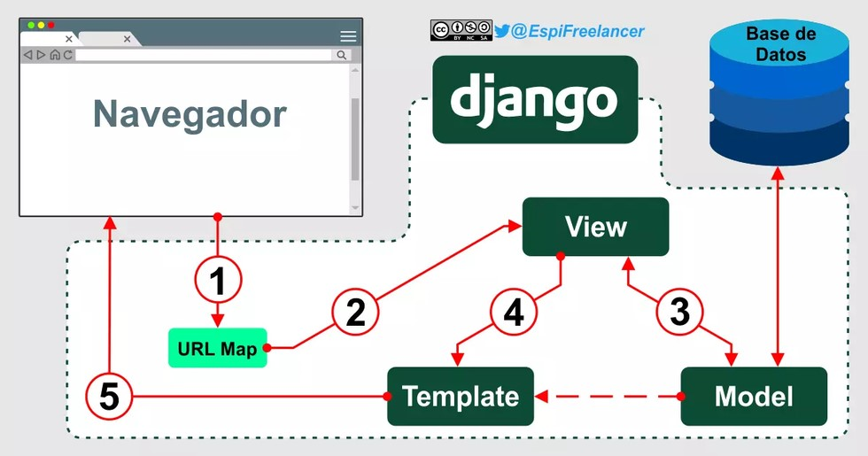

### Entornos virtuales

Los entornos virtuales de desarrollo o `virtualenvs` son herramientas que permiten aislar y gestionar las dependencias de un proyeto específico.

Estos entornos virtuales se utilizan para evitar conflictos entre las bibliotecas y paquetes de diferentes proyectos, lo que facilita la gestión de las dependiencias y hace que el desarrollo sea más ordenado y eficiente.

Hay varias herramientas para crear y gestionar entornos virtuales en **Python**, entre las que destacan `virtualenv` y `venv`.

---

### Primeros pasos

Ingresa a la paleta de comandos en **VS Code** con el comando `Ctrl + Shift + P` o seleccionando desde la pestaña `View` en **VS Code**.

Busca `Python: Default Interpreter` y selecciona la versión de **Python** que deseas usar para este proyecto.

---

Ahora, abre una terminal dentro de VS Code con el comando `Ctrl + Shift + ñ` o seleccionando desde la pestaña `Terminal` en **VS Code**.

En la terminal, ejecuta el siguiente comando para crear un entorno virtual con el nombre que elijas. 
```python
python -m venv nombre_env
```
---

### Activación y desactivación

Depues de crear el entorno virtual, puedes activarlo ejecutando el siguiente comando en la misma terminal.

```python
nombre_env/Scripts/activate
```

Ahora, puedes instalar las bibliotecas y paquetes especificos que necesita tu proyecto dentro del entorno virtual activado.

Cuando hayas terminado de trabajar en tu proyecto y quieras salir del entorno virutal, simplemente ejectuta el comando en la terminal.
```python
nombre_env/Scripts/deactivate
```

---

### Django

**Web Framework** para la creación de aplicaciones web en **Python**.

---

**1. Modelo-Vista-Plantilla (MVT)**



---

En esta arquitectura, el **Modelo** representa los datos y la lógica de la base de datos, la **Vista** maneja la presentación y la **Plantilla** se encarga de la lógica de presentación.

**2. Object-Relational Mapping (ORM)**

**Django** proporciona un **ORM** que permite a los desarrolladores interactuar con la base de datos utilizando objetos y métodos en lugar de escribir consultas **SQL** directamente.

Esto facilita la gestión de datos y la abstracción de la capa de base de datos.

---

**3. Enrutamiento de URLs**

**Django** ofrece un sistema de enrutamiento que permite mapear **URLs** a vistas específicas. Esto facilita la creación de rutas para diferentes páginas y acciones en tu aplicación web.

**4. Plantillas**

**Django** incluye un sistema de plantillas que permite separar la lógica de presentación del código **Python**. Esto facilita la creación de páginas web dinámicas y la reutilización de componentes.

---

**5. Autenticación y autorización**

**Django** proporciona un sistema de autenticación y autorización listo para usar. Puedes gestionar usuarios, roles y permisos de manera eficiente.

**6. Admin panel**

**Django** genera automáticamente un panel de administración para tu aplicación basado en el modelo de datos que defines. Esto facilita la gestión y manipulación de datos de la base de datos sin tener que escribir una interfaz de administración desde cero.

---

**7. Formularios**

**Django** ofrece un sistema de formularios que facilita la validación y el manejo de datos enviados por los usuarios a través de formularios web.


**8. Internacionalización y localización**

Puedes crear aplicaciones web multilingües y adaptadas a diferentes regiones utilizando las capacidades de internacionalización y localización de **Django.**

---

**9. Seguridad**

**Django** incorpora medidas de seguridad para prevenir vulnerabilidades comunes, como ataques de inyección **SQL**, cross-site scripting **XSS** y más.

**10. Caché y optimizacion de consultas**

**Django** proporciona herramientas para cachear contenido y optimizar consultas de base de datos, mejorando el rendimiento de la aplicación.

---

**11. Migraciones de base de datos**

Con las migraciones de **Django**, puedes realizar cambios en el modelo de datos y aplicarlos a la base de datos de manera sencilla y controlada.

**12. Soporte para REST y GraphQL**

**Django** ha evolucionado para admitir **APIs REST** y **GraphQL** para crear aplicaciones de una sola página y servicios web.

---

### Instalación

Abre una terminal o linea de comandos y ejecuta el siguiente comando para instalar **Django** usando ```pip```

```python
pip install django
```

---
### Crear un nuevo proyecto

Una vez que **Django** esté instalado, puedes crear un nuevo proyecto. 

En la terminal, navega hasta la ubicación donde deseas crear tu proyecto y ejecuta el siguiente comando

```python
django-admin startproject nombre_proyecto
```

Reemplaza ```nombre_proyecto``` con el nombre que desees darle a tu proyecto. 

Esto creará una carpeta con el nombre del proyecto y contendrá la estructura inicial de tu proyecto **Django**.

---

### Iniciar el servidor de desarrollo

Dentro de la carpeta de tu proyecto, ejecuta el siguiente comando para iniciar el servidor de desarrollo de Django:

```python
cd nombre_proyecto
python manage.py runserver
```

El servidor se ejecutará en tu servidor local ```http://127.0.0.1:8000/```.

---

### Comprobar funcionalidad

Si accedes a ```http://127.0.0.1:8000/```, deberías ver una página de bienvenida de **Django** que indica que el servidor se está ejecutando correctamente.